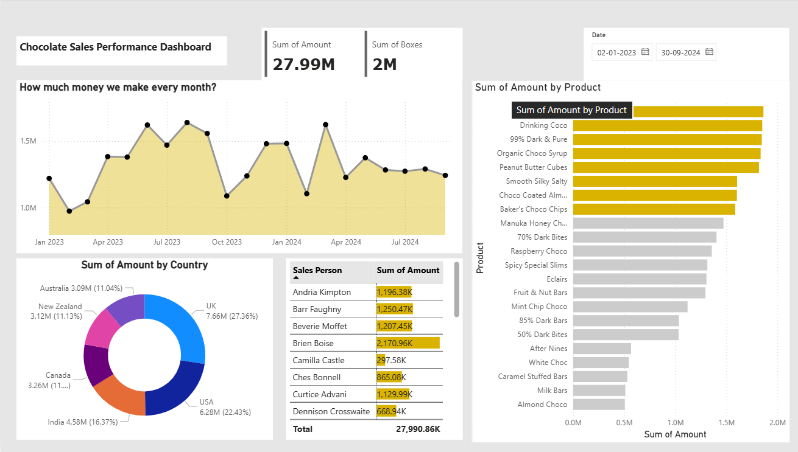

# 🍫 Chocolate Sales Performance Dashboard

An interactive Power BI dashboard designed to analyze chocolate sales performance across different products, countries, sales persons, and time periods.

## 📊 Dashboard Overview

The dashboard provides insights into:

- Monthly sales performance
- Total sales amount
- Total boxes sold
- Sales by product
- Sales by country
- Sales person performance
- Date-based sales analysis

## 🛠️ Tools & Technologies

- Microsoft Power BI
- DAX
- Power Query
- Data Visualization
- Data Modeling

## 📈 Key Dashboard Features

### Sales Performance
Shows how much revenue was generated every month.

### Product Analysis
Compares the sales amount generated by different chocolate products.

### Country Analysis
Displays sales contribution from different countries.

### Sales Person Analysis
Provides a comparison of sales performance among sales persons.

### Date Filter
Allows users to analyze sales for a selected date range.

## 📷 Dashboard Preview

## 📁 Project Files

- `Chocolate_Sales_Performance_Dashboard.pbix` – Power BI dashboard file
- `Dashboard.png` – Dashboard preview

## 🎯 Objective

The objective of this project is to transform chocolate sales data into an interactive dashboard that helps users understand sales trends, product performance, geographical performance, and salesperson performance.

## 👩‍💻 Created Using

**Microsoft Power BI**
